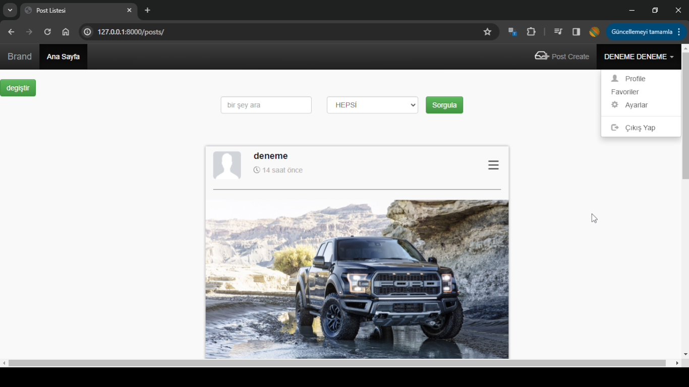
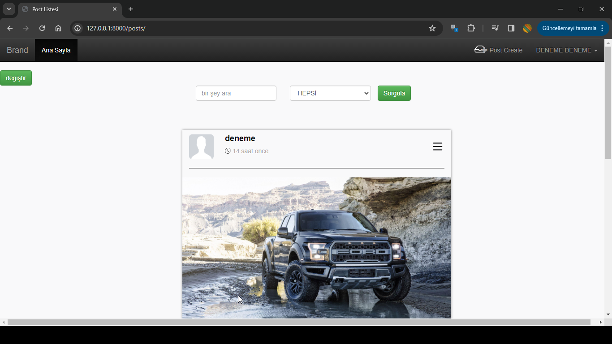
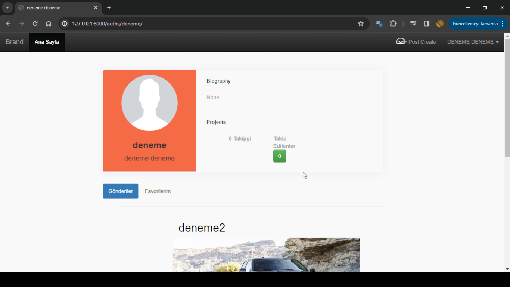
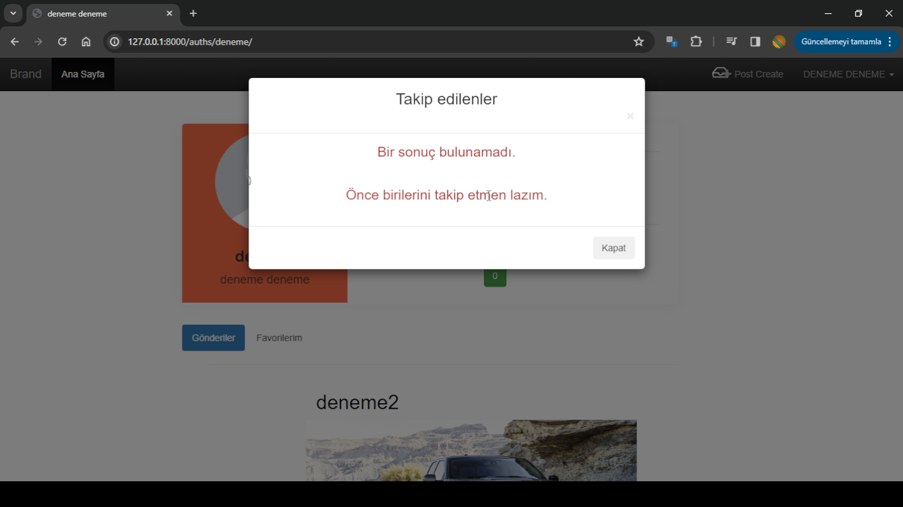
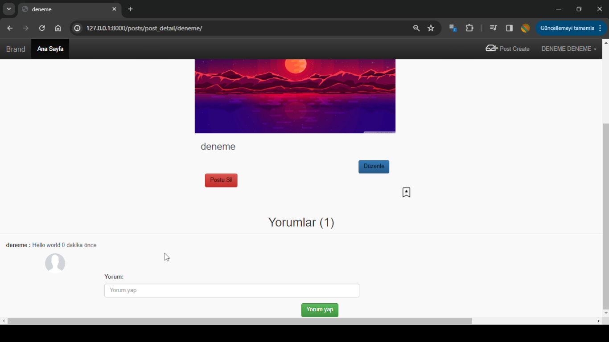
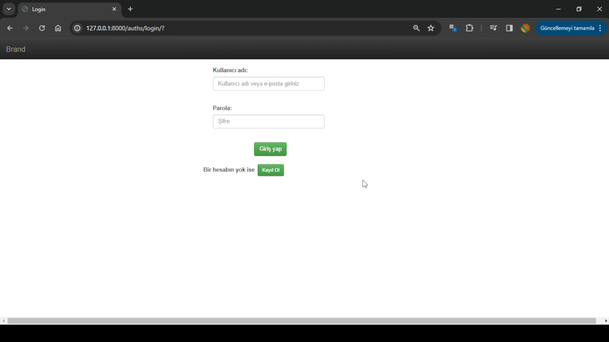
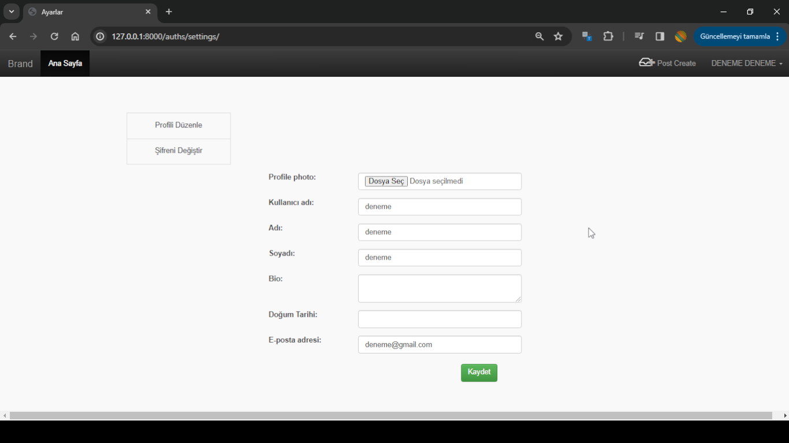

# Django Blog app

## Overview

Basic blog - social media website with Django Framework.

## Features

- Add, Update, Delete posts system.
- Follow, unfollow system.
- Comment system.
- Chat app created but messages didn't crypted

## Requirements

- Python 3.7.7
- Django 3.1.7

## Installation

1. Clone the repository
```
git clone https://github.com/urdurak/Django-first-app.git
```

## Screenshots

- Main Page
  
 

- Profile

 

- Comment



- Login, Settings

 

## Contact

- Instagram : https://www.instagram.com/urdurak/
- E-mail : ugrdrak@gmail.com
- E-mail 2: ugurdurak52@gmail.com
